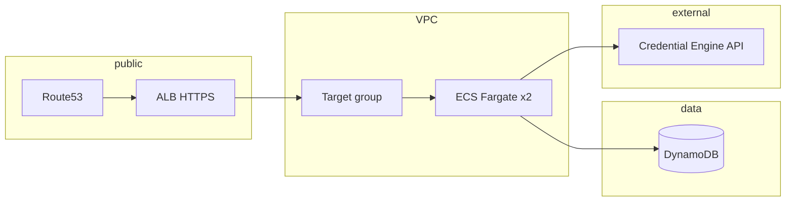

# Design: skills-verifier staging (AWS)

## Scope of work

Run **skills-verifier** on **ECS Fargate** in staging with **two small tasks**, **DynamoDB** persistence, **HTTPS** on **`verifier.staging.prettygoodskills.com`** via a **dedicated ALB**, **Credential Engine** using **existing staging CE variables** (same values as OSMT), and **images built from the monorepo wrapper** pattern. Terraform: **publishable module in the monorepo** at **`terraform/skills-verifier/aws/`** (same pattern as **`terraform/osmt/aws/`**), consumed from **`infra/environments/staging`** via TFC `skills-verifier/aws`. Production hostname **`verifier.prettygoodskills.com`** is a future use of the same module with different inputs.

**Out of scope:** Autoscaling policy beyond fixed desired count, multi-region, production workspace apply (unless you extend infra similarly).

## Local worktrees (this effort)

Monorepo and **infra** changes for this plan are developed in a shared worktree:

| Path                                                       | Repository role                                                                              |
| ---------------------------------------------------------- | -------------------------------------------------------------------------------------------- |
| **`/Users/yona/dev/skybridge/feature/verifier/monorepo/`** | `skybridgeskills-monorepo` — **`wrappers/skills-verifier/`**, **`.github/workflows/`**, etc. |
| **`/Users/yona/dev/skybridge/feature/verifier/infra/`**    | `infra` — **`environments/staging/main.tf`**, etc.                                           |

Run wrapper/build commands from the **monorepo** root. The **skills-verifier** **application** lives in the **`skills-verifier`** repo; **Terraform** for AWS lives in **`monorepo/terraform/skills-verifier/aws/`** (like OSMT).

## Resolved decisions

| Topic       | Decision                                                                                                                                                                                                    |
| ----------- | ----------------------------------------------------------------------------------------------------------------------------------------------------------------------------------------------------------- |
| Terraform   | Module in **monorepo** `terraform/skills-verifier/aws/`, published to TFC as **`skills-verifier/aws`** (OSMT-style), pinned in staging `main.tf`.                                                           |
| DNS / ALB   | Dedicated ALB; staging **`verifier.staging.prettygoodskills.com`**, prod **`verifier.prettygoodskills.com`**.                                                                                               |
| Storage     | **DynamoDB** in first release; app must use Dynamo for `CONTEXT=aws` when configured.                                                                                                                       |
| CE secrets  | Reuse staging **`credential_engine_api_key`**, **`credential_engine_registry_url`**; module derives **`CREDENTIAL_ENGINE_SEARCH_URL`**.                                                                     |
| Images      | Monorepo **`wrappers/skills-verifier/`** (in **`feature/verifier/monorepo`**) + workflows mirroring OSMT (`docker-build.sh`, `VERSION`, `update-source.sh`).                                                |
| Version API | **`GET /version`** — JSON like OSMT’s **`version.json`**: **`version`** = baked **skills-verifier** source ref; **`extra.sbsMonorepoVersion`** only when built from the monorepo wrapper (see phase 3 + 5). |

## Code quality / style (from [`docs/style/README.md`](../../style/README.md))

- Factory functions and providers — no new classes for DI.
- Keep new Terraform files focused; split when approaching ~200 lines of HCL per file.
- Env validation with Zod where app code changes (extend existing `AwsEnv` / patterns).

## File structure

Cross-repo layout. **App:** `skills-verifier` repo. **Terraform + wrapper + CI:** **`feature/verifier/monorepo`**. **Staging env:** **`feature/verifier/infra`**.

```
skills-verifier/                       # application repository only
├── package.json
├── svelte.config.js
├── src/...
├── terraform/
│   └── dynamodb.tf                     # pointer comment → AWS module lives in monorepo

feature/verifier/monorepo/             # skybridgeskills-monorepo
├── terraform/
│   └── skills-verifier/
│       └── aws/                       # NEW — same role as terraform/osmt/aws/
│           ├── versions.tf
│           ├── variables.tf
│           ├── locals.tf
│           ├── data.tf
│           ├── dynamodb.tf
│           ├── iam.tf
│           ├── security_groups.tf
│           ├── alb.tf
│           ├── route53.tf
│           ├── ecs_task_definition.tf
│           ├── ecs_service.tf
│           ├── cloudwatch.tf
│           └── outputs.tf
├── wrappers/
│   └── skills-verifier/
│       ├── VERSION
│       ├── update-source.sh
│       ├── docker-build.sh
│       └── Dockerfile
├── .github/workflows/
│   ├── skills-verifier-build.yml
│   └── main-push.yml                  # + terraform/skills-verifier change detection

feature/verifier/infra/environments/staging/
└── main.tf                            # module skills_verifier → app.terraform.io/.../skills-verifier/aws
```

## Conceptual architecture



**Flow:** Clients resolve **`verifier.staging…`** → **ALB** terminates TLS → forwards to **Fargate** tasks (SvelteKit Node server). Task **role** grants **DynamoDB** on the verifier table. **Execution role** pulls image from **ECR** and may read secrets. **Outbound** HTTPS to Credential Engine using env derived from shared staging CE variables.

## Main components and interactions

| Component            | Role                                                                                                                                                                                                                                                                                                                                                                                                                                                                                                   |
| -------------------- | ------------------------------------------------------------------------------------------------------------------------------------------------------------------------------------------------------------------------------------------------------------------------------------------------------------------------------------------------------------------------------------------------------------------------------------------------------------------------------------------------------ |
| **Wrapper + GHA**    | In **`feature/verifier/monorepo`**: check out app source, `pnpm build` with adapter-node, push **`skills-verifier:<tag>`** to ECR (same account/region pattern as OSMT).                                                                                                                                                                                                                                                                                                                               |
| **Terraform module** | Creates **DynamoDB** table (existing single-table design), **security groups**, **ALB + listener + cert**, **Route53 alias**, **ECS cluster/service** (or uses existing cluster from `config` — follow OSMT `data`/`config` shape), **task definition** with env: `CONTEXT=aws`, `DYNAMODB_TABLE`, `AWS_REGION`, `CREDENTIAL_ENGINE_*`, `HOST=0.0.0.0`, `PORT`. **Version strings** are baked in the image (Docker build-args), not duplicated as ECS env unless you choose to override for debugging. |
| **App**              | **`CONTEXT=aws`**: Zod requires CE + **DYNAMODB_TABLE** (+ region); **`createStorageDatabase()`** returns **`DynamoStorageDatabase`** with `DynamoDBDocumentClient`; queries use existing `dynamo` branches. **`GET /health`** returns **200** for ALB checks. **`GET /version`** returns deploy metadata (OSMT-style JSON); **`extra.sbsMonorepoVersion`** populated only for monorepo-built images.                                                                                                  |
| **Staging root**     | **`feature/verifier/infra/environments/staging`**: **`module.skills_verifier`** with **`var.config`**, image tag variable, FQDN, and same **`credential_engine_*`** values as OSMT.                                                                                                                                                                                                                                                                                                                    |

## Proposed implementation phases

1. **Adapter-node and runtime contract** — Switch SvelteKit to **`@sveltejs/adapter-node`**; document **`HOST`/`PORT`** for ECS; local `node build` smoke test.
2. **DynamoDB wiring in app** — Implement Dynamo branch in **`storage-database-factory.ts`**; extend **AWS env validation** for **`DYNAMODB_TABLE`** and region; adjust **`storage-database-ctx`** logging; tests for factory (mock client or integration optional).
3. **Health and version endpoints** — **`GET /health`** for ALB; **`GET /version`** returning OSMT-shaped JSON (**`version`** = skills-verifier source ref, **`extra.sbsMonorepoVersion`** when wrapper-built). Build-time **`ARG`/`ENV`** in Dockerfile; **`docker-build.sh`** supplies values like OSMT (**`SBS_MONOREPO_VERSION`** from monorepo **`print-app-version.sh`**, source version from **`source/`** git or **`VERSION`** file).
4. **Terraform module (`monorepo/terraform/skills-verifier/aws/`)** — Same publishing pattern as **`terraform/osmt/aws/`**; mirror OSMT layout subset (no RDS/Redis/OpenSearch); **desired_count = 2**, small Fargate.
5. **Monorepo wrapper** — **`wrappers/skills-verifier/`** scripts + Dockerfile; **`wrappers/README.md`** entry.
6. **Monorepo CI** — **`skills-verifier-build.yml`** + **`main-push.yml`** triggers (pattern: **`osmt-build.yml`**).
7. **Staging integration** — **`feature/verifier/infra/environments/staging`**: module block, outputs, pass **CE** + **config** + **container image** version.
8. **Cleanup and validation** — Update **`docs/deployment.md`** / **`docs/architecture.md`**; remove obsolete root **`terraform/dynamodb.tf`** or leave a thin redirect note; **`pnpm check`** / **`pnpm test`**; Terraform fmt/validate as applicable.

Phase detail lives in **`01-…md`–`08-…md`** in this directory (**`03-health-and-version-endpoints.md`**).
